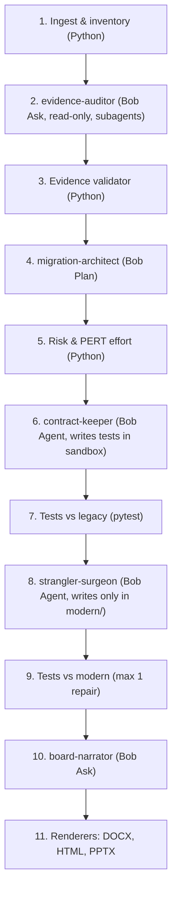

# CodeArchaeologist

**From "nobody dares to touch it" to a board-approved plan and a tested first migration step.**

> Built during the IBM Bob 2.0 Hackathon; see [docs/pre-event.md](docs/pre-event.md) for material prepared beforehand.

## Problem
Every company has a legacy system nobody dares to touch: the original authors are gone,
there are no tests, and every change feels like a gamble. Boards are asked to fund
modernization without evidence of what is inside, how risky it is, or where to start.

## What it does
Given a legacy repository (Python 3 + Flask + SQLite), CodeArchaeologist delivers:

1. **Technical dossier**: every finding points to a file and line range, and code validates each reference.
2. **Board memo (DOCX)**: risks and PERT effort ranges in plain language, with no figure that lacks a measurement.
3. **First migration cut (Strangler Fig)**: characterization tests that pass against the legacy code *and* against the new FastAPI implementation.

## How it uses IBM Bob 2.0
- **9 custom modes** ([.bob/custom_modes.yaml](.bob/custom_modes.yaml)):
  - Core Migration: `evidence-auditor`, `migration-architect`, `contract-keeper`, `strangler-surgeon`, `board-narrator`.
  - Extended Intelligence: `polyglot-architect`, `blast-radius-guard`, `code-skeptic`, `git-archaeologist`.
- **Specialized Subagents** ([agents/](agents/)): 16 forensic and engineering agents covering SQL audit, route mapping, dependency tracing, AST extraction, and adversarial review.
- **Shift-Left Pre-PR Risk Gate**: Non-mutating simulation predicting cascade failures ($CBRS$ 0-100) before human review.
- **Adversarial Tribunals**: Dialectical stress-testing between Architect and Skeptic agents.
- **Code Archaeology & Modernization**: PyDriller git commit mining + Tree-sitter/AST cartography with automated Mermaid ER diagrams.
- **FastMCP Telemetry Integration**: Connecting live DuckDB access analytics and SQLite read-only schemas to AI modes.
- **`bob run`**: Deterministic Python pipeline invokes Bob Shell non-interactively via `subprocess` (without `shell=True`).
- **Custom Slash Commands** ([commands/](commands/)): `/legacy-audit`, `/legacy-migrate`, `/migrate-framework`, `/risk-simulate`, `/code-tribunal`, `/code-archaeology`, `/legacy-report`, `/legacy-risk`, `/legacy-test`, `/legacy-onboard`.

## Architecture
A single Docker container runs FastAPI (API + worker), invokes Bob Shell via subprocess,
stores jobs in SQLite and serves the React + Vite build as static files.

Every result carries an `execution_mode`: `live`, `imported` or `example`.

## Scope and limitations
- Supported input: Python 3 + Flask + SQLite only.
- The full migration flow is guaranteed on the demo repository (`samples/facturaya-v1`); arbitrary ZIP uploads are a stretch goal.
- Uploaded code is analyzed statically and is never executed.
- Risk and effort figures are computed by code with explicit criteria, not generated by the AI.

## Quick start
TODO

## Security
Built on the official [IBM Hackathon GitHub project template](https://github.com/watsonxhackathon/ibm-hackathon-template).
See [SECURITY.md](SECURITY.md) for credential-handling rules; `.gitignore` and `.bobignore`
carry that template's security patterns unmodified.

## Demo and video
- Live demo: TODO
- Video (≤ 3 min, ≥ 90 s live demo — see [docs/demo-script.md](docs/demo-script.md)): TODO
- Per-teammate IBM Bob session screenshots: [bob-sessions/](bob-sessions/)

## Team
- **Jean**: Product Owner, DevOps, pitch
- **Felipe**: AI and IBM Bob integration
- **Daniel**: backend, pipeline and exporters
- **Edgar**: frontend

## License
[MIT](LICENSE)
