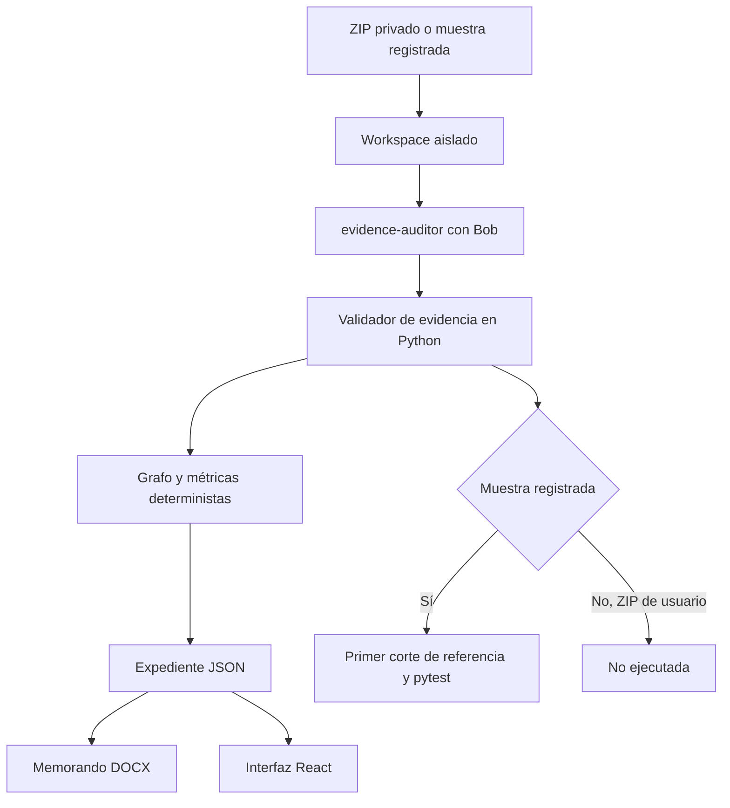

# CodeArchaeologist × IBM Bob 2.0

CodeArchaeologist audita repositorios heredados Python 3, Flask y SQLite. Entrega evidencia verificable por archivo y línea, un memorando DOCX con riesgo y esfuerzo calculados y, para la muestra controlada FacturaYa, un primer corte Strangler Fig probado con pytest.

Construido durante el IBM Bob 2.0 Hackathon. El material preparado antes del evento está declarado en [docs/pre-event.md](docs/pre-event.md).

## Entregas disponibles

1. **Expediente técnico.** Bob propone hallazgos y Python comprueba que cada archivo, rango de líneas y fragmento exista. La interfaz muestra el expediente, el código citado, el grafo de llamadas y la arquitectura medida.
2. **Memorando para la junta.** Cada auditoría genera `board_memo.docx`. El documento conserva el ID, hash SHA-256 y modo de la auditoría; su matriz de riesgo y rango PERT provienen de cálculos deterministas. Actualmente usa narrativa basada solo en datos, sin una narración numérica generada por Bob.
3. **Primer corte probado.** Solo las muestras registradas ejecutan la implementación de referencia del equipo para `GET /invoices/{id}`. Pytest corre contra el legado y contra FastAPI, reporta cada caso y publica `migration.diff`. El código subido por visitantes nunca se ejecuta.

Cada resultado muestra `execution_mode`: `live`, `imported` o `example`.

## Uso de IBM Bob

El pipeline activo invoca Bob Shell con el modo `evidence-auditor` mediante `subprocess` con una lista de argumentos y sin `shell=True`. El contenido del repositorio se trata como datos y el workspace excluye `evaluation/`, pruebas de evaluación y credenciales. Los modos, agentes y skills disponibles viven en `.bob/`; [docs/bob-usage.md](docs/bob-usage.md) distingue las sesiones ejecutadas de los diseños no ejecutados.

La vitrina pública reproduce una sesión real grabada de Bob (`contracts/fixtures/bob-session-facturaya.json` y su actividad en `bob-events-facturaya.jsonl`): se ve cómo el orquestador planifica, delega en paralelo en 4 subagentes y entrega el expediente. Abrirla no invoca Bob ni consume bobcoins. Una auditoría `live` sí requiere `BOB_API_KEY` en el servidor y `X-Live-Token` en la petición, y su actividad se ve en vivo en la sección **Sesión de Bob**.

Si Bob agota su presupuesto o el servicio corta la conexión antes de entregar el JSON, el pipeline reanuda la misma sesión con un turno de cierre (reservado dentro de `BOB_MAX_COST`) en lugar de perder el trabajo hecho.

## Arquitectura activa



FastAPI sirve la API y el build de React desde un solo contenedor. Los metadatos de trabajos se guardan en SQLite; los artefactos viven bajo `ARTIFACTS_DIR`.

## Seguridad y privacidad

- `POST /api/audits/upload` siempre exige `LIVE_AUDIT_TOKEN`.
- Los trabajos con origen `upload:` no aparecen en `GET /api/audits` sin un token válido.
- Expediente, fuente, grafo, arquitectura, migración y descargas de una subida responden 403 sin token.
- Las muestras registradas son públicas y no contienen código de visitantes.
- Los ZIP se validan contra ZipSlip y límites de tamaño. Su código se analiza estáticamente y nunca se ejecuta.
- Las credenciales viven en variables de entorno; consulte [SECURITY.md](SECURITY.md).

## Inicio rápido

Requisitos: Python 3.11+, Node 24+ y, solo para auditorías live, Bob Shell 2.0 con una API key.

```bash
python -m venv .venv
# Windows
.venv\Scripts\python -m pip install -r backend\requirements.txt
cd frontend
npm ci
npm run build
cd ..
```

Configure el servidor:

```bash
copy .env.example .env
# BOB_API_KEY=...
# LIVE_AUDIT_TOKEN=...
```

No incluya `.env` en commits. Para arrancar la aplicación:

```bash
.venv\Scripts\python -m uvicorn backend.app.main:app --port 8000
```

Abra `http://127.0.0.1:8000`. Desde Inicio puede:

- pulsar **Ver auditoría real de FacturaYa** sin token; o
- subir un ZIP y pulsar **Auditar en vivo** con token.

## Pruebas

```bash
$env:PYTHONPATH="backend"
.venv\Scripts\python -m pytest backend\tests -q
.venv\Scripts\python -m pytest samples\facturaya-v1\tests -q
cd frontend
npm run build
```

Las pruebas normales no invocan Bob: sustituyen la llamada live por la respuesta real grabada. Las pruebas del primer corte sí ejecutan el código de la muestra controlada en un subproceso sin variables de credenciales.

## API pública

| Método | Endpoint | Descripción |
|---|---|---|
| `GET` | `/health` | Estado del servicio |
| `GET` | `/api/bob/status` | Disponibilidad local de Bob y activos descubiertos |
| `GET` | `/api/samples` | Muestras registradas |
| `POST` | `/api/audits` | Abre una muestra `imported` o inicia una muestra `live` con token |
| `POST` | `/api/audits/upload` | Sube un ZIP privado e inicia una auditoría live con token |
| `GET` | `/api/audits` | Lista muestras públicas; con token incluye las subidas privadas |
| `GET` | `/api/audits/{id}` | Estado y expediente; las subidas exigen token |
| `GET` | `/api/audits/{id}/source` | Fuente citada; las subidas exigen token |
| `GET` | `/api/audits/{id}/graph` | Grafo y radio de impacto medidos |
| `GET` | `/api/audits/{id}/architecture` | Arquitectura, rutas, SQL y complejidad medidos |
| `GET` | `/api/audits/{id}/migration` | Código legado/moderno y resultados pytest |
| `GET` | `/api/audits/{id}/files/{name}` | `dossier.json`, `bob-result.json`, `board_memo.docx` o `migration.diff` |

El motor histórico `/api/jobs` está apagado por defecto y no forma parte del producto público.

## Alcance y limitaciones

- Entrada soportada en el MVP: Python 3, Flask y SQLite.
- Bob audita el código; no genera ni ejecuta el primer corte que se muestra en el producto.
- La implementación moderna y sus pruebas son una referencia preparada por el equipo para FacturaYa.
- En una subida arbitraria, la etapa de migración se informa como `not_run` para mantener la prohibición de ejecutar código del usuario.
- La grabación versionada disponible corresponde a la sesión documentada del 25 de septiembre a las 13:50. El artefacto de la corrida de las 15:22 no está en el repositorio y no se presenta como reproducible.

## Equipo

- Jean: Product Owner, DevOps y pitch
- Felipe: integración de IBM Bob
- Daniel: backend, métricas deterministas y exportadores
- Edgar: frontend y UX

## Licencia

[MIT](LICENSE)
