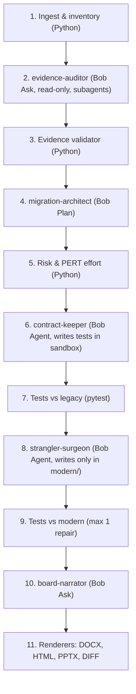

# LegacyLens (CodeArchaeologist) × IBM Bob 2.0

**From "nobody dares to touch it" to a board-approved plan and a tested first migration step.**

> Built during the IBM Bob 2.0 Hackathon; see [docs/pre-event.md](docs/pre-event.md) for material prepared beforehand.

---

## Problem
Every company has a legacy system nobody dares to touch: the original authors are gone, there are no tests, and every change feels like a gamble. Boards are asked to fund modernization without evidence of what is inside, how risky it is, or where to start.

## What it does
Given a legacy repository (Python 3 + Flask + SQLite), LegacyLens delivers:

1. **Technical dossier**: every finding points to a real file and line range, verified by a 100% deterministic physical evidence validator (zero hallucination).
2. **Board memo (DOCX)**: executive decision memorandum with PERT effort ranges, composite blast radius ($CBRS$) and risk matrix in plain business language.
3. **First migration cut (Strangler Fig)**: characterization tests that pass against the legacy code *and* against the modern FastAPI service (`modern/invoices_api.py` + `facade.py`).
4. **Interactive Dashboard & Presentation**: Standalone HTML report with embedded Mermaid diagrams and executive 16:9 slides (`presentation.pptx`).

---

## How it uses IBM Bob 2.0
- **9 custom modes** ([.bob/custom_modes.yaml](.bob/custom_modes.yaml)):
  - Core Migration: `evidence-auditor`, `migration-architect`, `contract-keeper`, `strangler-surgeon`, `board-narrator`.
  - Extended Intelligence: `polyglot-architect`, `blast-radius-guard`, `code-skeptic`, `git-archaeologist`.
- **Specialized Subagents** ([.bob/agents/](.bob/agents/)): 16 forensic and engineering agents covering SQL audit, route mapping, dependency tracing, AST extraction, and adversarial review.
- **Shift-Left Pre-PR Risk Gate**: Non-mutating simulation predicting cascade failures ($CBRS$ 0-100) before human review.
- **Adversarial Tribunals**: Dialectical stress-testing between Architect and Skeptic agents.
- **Code Archaeology & Modernization**: PyDriller git commit mining + Tree-sitter/AST cartography with automated Mermaid ER diagrams.
- **FastMCP Telemetry Integration**: Connecting live DuckDB access analytics and SQLite read-only schemas to AI modes.
- **`bob run`**: Deterministic Python pipeline invokes Bob Shell non-interactively via `subprocess` (without `shell=True`).
- **Custom Slash Commands** ([.bob/skills/](.bob/skills/), invocables como `/nombre`): `/legacy-audit`, `/legacy-migrate`, `/migrate-framework`, `/risk-simulate`, `/code-tribunal`, `/code-archaeology`, `/legacy-report`, `/legacy-risk`, `/legacy-test`, `/legacy-onboard`, `/code-audit`.

---

## Architecture

A single Docker container runs FastAPI (API + deterministic worker), invokes Bob Shell via safe subprocess, stores jobs in SQLite with WAL mode, and serves the React + Vite build as static files.



Every result carries an `execution_mode`: `live`, `imported` or `example` (Rule D8).

---

## Scope and limitations
- Supported input: Python 3 + Flask + SQLite only.
- The full migration flow is guaranteed on the demo repository (`samples/facturaya-v1`); arbitrary ZIP uploads are validated with ZipSlip defense.
- Uploaded code is analyzed statically and in isolated sandboxes.
- Risk and effort figures are computed deterministically by code ($CBRS$ & PERT), not generated by the AI.

---

## Quick Start

### 1. Requirements & Installation
Requirements: Python 3.11+, Node 24+, and optional [Bob Shell](https://bob.ibm.com/docs/shell/getting-started/install-and-setup) with API Key.

```bash
# Clone and enter the repository
cd CodeArchaeologist-AI-x-BOB-2.0

# Install backend dependencies
pip install -r backend/requirements.txt

# Build the React frontend
cd frontend && npm install && npm run build && cd ..
```

### 2. Configuration (IBM Bob 2.0 API Key)
Copy the template and configure your key (optional for `live` mode; runs in high-fidelity `example` mode if unset):
```bash
cp .env.example .env
# Edit .env:
# BOB_API_KEY=your_key_here
# LEGACYLENS_EXECUTION_MODE=live
```

### 3. Run the CLI Audit (11 Deterministic Stages)
Audit the bundled legacy monolith (`FacturaYa v1`) directly from terminal:
```bash
python -m backend.app.cli_audit --sample samples/facturaya-v1/
```
Artifacts are saved in `artifacts/`:
- `board_memo.docx` — Executive Word memorandum for the Board.
- `report.html` — Interactive standalone report with embedded Mermaid diagrams.
- `presentation.pptx` — 6-slide executive presentation in 16:9 widescreen.
- `migration.diff` — Unified Strangler Fig patch.

### 4. Start the FastAPI Web Server & UI
```bash
python -m uvicorn backend.app.main:app --port 8000 --reload
```
- Open [http://127.0.0.1:8000](http://127.0.0.1:8000) for the React SPA.
- Open [http://127.0.0.1:8000/docs](http://127.0.0.1:8000/docs) for Swagger UI.
- Open [http://127.0.0.1:8000/health](http://127.0.0.1:8000/health) for Health and Bob telemetry.

### 5. Run the Automated Tests
```bash
# Backend test suite (Daniel + Felipe)
python -m pytest backend/tests/ -v

# Characterization tests on legacy sample
python -m pytest samples/facturaya-v1/tests -v
```

---

## API Endpoints

| Method | Endpoint | Description |
| :--- | :--- | :--- |
| `GET` | `/health` | Service health, Bob Shell CLI status, execution mode |
| `POST` | `/api/jobs` | Enqueue a new audit job (`demo`, `holdout`, or `zip` upload) |
| `GET` | `/api/jobs` | List recent jobs with stage progress and durations |
| `GET` | `/api/jobs/{id}` | Poll job status, current stage (1–11), and timeline events |
| `GET` | `/api/jobs/{id}/result` | Full validated `DossierResult` JSON (Schema v1.0) |
| `POST` | `/api/jobs/{id}/migrate` | Trigger Strangler Fig cut and characterization test execution |
| `GET` | `/api/jobs/{id}/artifacts/{kind}` | Download generated artifact (`docx`, `html`, `pptx`, `diff`) |
| `GET` | `/api/bob/status` | Telemetry on discovered Bob custom modes, agents and skills |
| `GET` | `/api/samples` | List available legacy samples (`facturaya-v1`, `variant-holdout`) |
| `POST` | `/api/audits` | Start an audit job for the React frontend |
| `GET` | `/api/audits/{id}` | Read audit job state and dossier for the UI |
| `GET` | `/api/audits/{id}/source` | Read sliced source code for the interactive Evidence Viewer |

---

## Bob Assets (`.bob/`)

| Folder | Content |
|---|---|
| `.bob/custom_modes.yaml` | 9 custom modes with route-restricted edit permissions |
| `.bob/agents/*.md` | 16 forensic and engineering subagents (group `subagent`) |
| `.bob/skills/*/SKILL.md` | Knowledge skills and `/command` workflows |
| `.bob/rules/`, `.bob/rules-<mode>/` | Global and mode-specific operational constraints |

---

## Team
- **Jean**: Product Owner, DevOps, pitch
- **Felipe**: AI and IBM Bob integration
- **Daniel**: Backend, deterministic pipeline, risk engine, and exporters
- **Edgar**: Frontend UI & UX

---

## License
[MIT](LICENSE)
