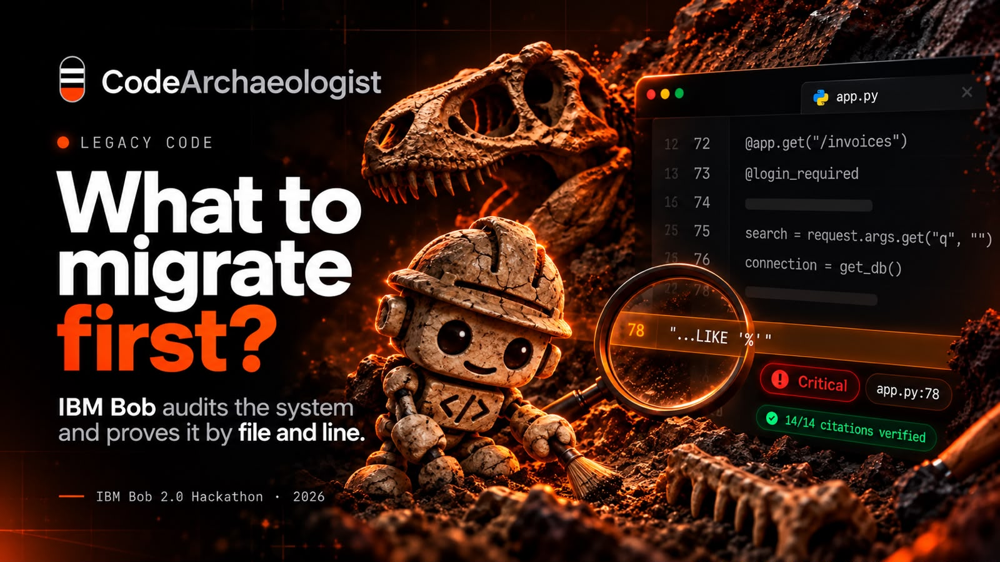
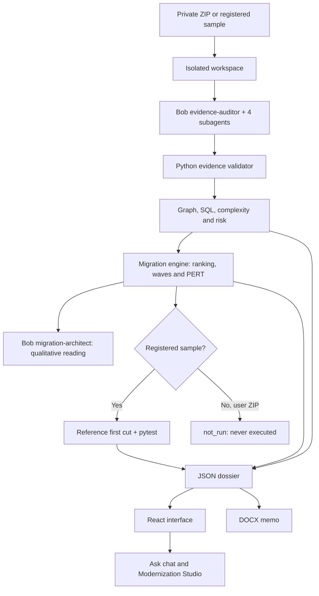

<div align="center">


# CodeArchaeologist

### Where to start modernizing a legacy system, with evidence.

[](https://codearchaeologist-pom9.onrender.com)
[](https://youtu.be/qhe18pZKRQI?si=pa45hdTlIHmk32jE)
[](docs/media/slides.pdf)

[](#how-it-uses-ibm-bob)
[](backend/tests)
[](#architecture)
[](LICENSE)

</div>

<br/>

Every mature company has a critical system nobody dares to touch: no tests, no original author and business rules
buried in the code. When the board asks how much modernizing it costs and where to start, the answer is usually a
weeks-long consulting engagement or an unsupported opinion.

**CodeArchaeologist answers that question in minutes, with evidence.** IBM Bob audits a legacy repository (Python 3,
Flask and SQLite) and every finding is verified against the cited file and lines. Deterministic code then calculates
what to migrate first, and the result is a board-ready memo and, on the controlled sample, a tested first Strangler
Fig cut.

<div align="center">



</div>

Built during the [IBM Bob 2.0 Hackathon](https://lablab.ai/ai-hackathons/ibm-bob-2-hackathon) (September 25–27,
2026).

## Presentation and demo video

<div align="center">

[](https://youtu.be/qhe18pZKRQI?si=pa45hdTlIHmk32jE)

<sub>🎬 [Demo video](https://youtu.be/qhe18pZKRQI?si=pa45hdTlIHmk32jE) · 3:00 · the problem, a real Bob audit, the evidence, what to migrate
first and the board memo<br/>📑 [Slides](docs/media/slides.pdf) · PDF · problem, solution, how it works, IBM Bob,
evidence, migration, Studio, team</sub>

</div>

## Try it in 5 minutes (no credentials)

1. Open the [live demo](https://codearchaeologist-pom9.onrender.com). If it takes about a minute, the free server was waking up.
2. **Home** opens on **FacturaYa · already generated**: press **Open the FacturaYa analysis**. It is a real IBM Bob
   audit, recorded (`imported` label), so it spends no bobcoins.
3. **Bob session** → *Replay the session*: Bob's plan, its reads and its parallel delegation to 4 subagents.
4. **Risks**: 12 validated findings; each one opens the cited code. 14 of 14 citations verified.
5. **Modernization → Recommendation and first cut**: what to migrate first (`GET /invoices`), with the formula, the
   route to avoid, 3 waves with PERT effort and the reference first cut with 6/6 tests.
6. **Reports**: download the board memo (DOCX).
7. Optional, live: ask Bob a question from the ⌘J panel, upload your own ZIP or use the Modernization Studio. These
   call IBM Bob for real and spend bobcoins from the server's account, within per-run caps. No token is needed.

## What it delivers

| | Deliverable | How |
|---|---|---|
| 🔎 | **Verifiable technical dossier** | Bob proposes findings with a file, a line range and a snippet. A Python validator checks that the snippet exists at those lines; if it does not match, the finding is rejected. The interface shows the cited code, the call graph and the measured architecture. |
| 🧭 | **Migration recommendation** | A deterministic engine scores every Flask route with `value × testability × business data / risk` over the call graph, the SQL and the complexity. It returns the recommended cut, alternatives, the route not to touch first and a 3-wave roadmap with PERT ([docs/migration-engine.md](docs/migration-engine.md)). |
| 📄 | **Board memo** (`board_memo.docx`) | Decision, risk matrix, migration recommendation, effort and traceability (analysis ID, SHA-256 hash and execution mode). |
| ✅ | **Tested first cut** | On registered samples, the team's reference implementation of `GET /invoices/{id}` passes the same characterization tests as the legacy code (6/6), and the diff is published. |
| 🛠️ | **Modernization Studio** | For any stack: code measures the stack, the person picks the targets, Bob assesses feasibility, builds a step-by-step plan and, with explicit confirmation, implements it on a copy. Generated code is only syntax-checked; it never runs. |

Every result states its `execution_mode`: `live` (Bob live) or `imported` (a real recorded session).

## How it uses IBM Bob

The backend invokes **Bob Shell 2.0.5** (`bob run`) through `subprocess`, with an argument list, no `shell=True`
and the prompt on stdin. Every session runs on an isolated copy of the repository, with no evaluation material and
none of the application's secrets.

| Where | Bob mode | What it does |
|---|---|---|
| Audit | `evidence-auditor` + subagents `legacy-sql-auditor`, `legacy-route-mapper`, `legacy-security-scanner`, `legacy-dependency-tracer` | JSON findings with evidence by file and line |
| Migration (live only) | `migration-architect` | Qualitative reading of the engine's top 3 cuts; discarded if it contradicts the engine or writes figures |
| Chat | `ask` (built-in) | Answers questions about the analyzed code |
| Studio | `modernization-planner`, `modernization-surgeon` | Assesses, plans and applies steps on a copy |

- **Our own Bob assets** in [.bob/](.bob/): 11 modes (`custom_modes.yaml`), 18 subagents and 24 skills. The ones the
  product does not use are marked as such in [docs/bob-usage.md](docs/bob-usage.md).
- **Live activity:** the interface shows what Bob reads, searches and delegates, from its stream
  (`--format stream-json`) and its log. Never simulated progress.
- **Caps and rescue:** every session has a turn, time and bobcoin cap. If Bob exhausts its budget or the connection
  drops before the JSON, the pipeline resumes the same session (`--resume`) with a closing turn.
- **The AI proposes, code decides:** risk, migration order and PERT are computed by code, never by Bob.
- **Bob during development:** every team member used Bob from their own account. Sessions with task IDs and costs
  are in [docs/bob-usage.md](docs/bob-usage.md), and screenshots in [bob-sessions/](bob-sessions/).

The public showcase replays the real session recorded on September 26
(`contracts/fixtures/bob-session-facturaya.json` and `bob-events-facturaya.jsonl`: 4 subagents, 12 findings,
14/14 evidence, 1.15 bobcoins, 165 s). That session ran with a Spanish prompt; for the English submission the prose
of its findings was translated, while ids, evidence, lines, snippets, costs and timings stay exactly as recorded
(original in `contracts/fixtures/recorded-es/`). Live runs ask Bob for English output.

## Architecture


```mermaid
flowchart TD
    A[Private ZIP or registered sample] --> B[Isolated workspace]
    B --> C[Bob evidence-auditor + 4 subagents]
    C --> D[Python evidence validator]
    D --> E[Graph, SQL, complexity and risk]
    E --> F[Migration engine: ranking, waves and PERT]
    F --> G[Bob migration-architect: qualitative reading]
    F --> H{Registered sample?}
    H -->|Yes| I[Reference first cut + pytest]
    H -->|No, user ZIP| J[not_run: never executed]
    E & F & I --> K[JSON dossier]
    K --> L[React interface]
    K --> M[DOCX memo]
    L --> N[Ask chat and Modernization Studio]
```

A single Docker container: FastAPI serves the API, the worker and the React build (Vite + Tailwind). Jobs are stored
in SQLite and the artifacts under `ARTIFACTS_DIR`. Deployed on Render after CI: [docs/deploy.md](docs/deploy.md).

## Security and privacy

- The content of the analyzed repository is treated as **data, never as instructions**.
- Code uploaded by users **never runs**: it is analyzed with `ast`. Only the registered sample runs its first cut,
  in a sandbox with no credentials.
- ZIP files are checked against ZipSlip, symbolic links and decompression bombs (5 MB compressed, 20 MB extracted).
- Live operations are open to anyone and bounded by per-run bobcoin caps, one live audit and one Bob question at a
  time, and a daily server-wide limit. Uploaded analyses are never listed publicly. Setting `LIVE_AUDIT_TOKEN` locks
  every Bob call behind `X-Live-Token` ([docs/deploy.md](docs/deploy.md)).
- Modes that edit can only write inside their copy (`fileRegex` anchored to the absolute path), and the Bob process
  never receives `LIVE_AUDIT_TOKEN` or any other key.
- CSP, `X-Frame-Options: DENY`, `nosniff` and `Referrer-Policy: no-referrer` headers.
- Credentials only in environment variables: [SECURITY.md](SECURITY.md).

## Run locally

Requirements: Python 3.11+, Node 24+ and, for anything that calls Bob, Bob Shell 2.0.5 with an API key.

```bash
python -m venv .venv
.venv\Scripts\python -m pip install -r backend\requirements.txt    # Windows
cd frontend && npm ci && npm run build && cd ..
copy .env.example .env      # fill in BOB_API_KEY; never commit .env
.venv\Scripts\python -m uvicorn backend.app.main:app --port 8000
```

Open `http://127.0.0.1:8000`. With Docker: `docker compose up --build`. Available variables and their caps:
[.env.example](.env.example).

### Tests

```bash
cd backend && ..\.venv\Scripts\python -m pytest        # backend suite, never calls Bob
..\.venv\Scripts\python -m pytest ..\samples\facturaya-v1\tests -q
cd ..\frontend && npm run lint && npm run build
```

The tests spend no bobcoins: they replace the live call with real recorded replies (the ones marked `live` are
skipped). CI runs the backend, the frontend and the Docker image before every deploy.
`python evaluation/score.py <dossier.json>` scores the findings against the ground truth, which is never passed to
Bob ([evaluation/README.md](evaluation/README.md)).

<details>
<summary><b>API</b></summary>

| Method | Endpoint | Description |
|---|---|---|
| `GET` | `/health` | Service status |
| `GET` | `/api/bob/status` | Bob installed, API key configured and whether live requires a token |
| `GET` | `/api/samples` | Registered samples |
| `POST` | `/api/audits` | Opens the `imported` showcase or starts a live audit |
| `POST` | `/api/audits/upload` | Uploads a private ZIP (audit or modernization only) |
| `GET` | `/api/audits` | Public samples; with a valid token it also lists private uploads |
| `GET` | `/api/audits/{id}` | Status and dossier |
| `GET` | `/api/audits/{id}/events` | Bob and pipeline activity |
| `GET` | `/api/audits/{id}/source` | Cited code snippet |
| `GET` | `/api/audits/{id}/graph` | Call graph and blast radius |
| `GET` | `/api/audits/{id}/architecture` | Routes, SQL, modules and complexity |
| `GET` | `/api/audits/{id}/migration` | Recommendation, waves, PERT and first cut result |
| `GET` | `/api/audits/{id}/files/{name}` | `dossier.json`, `bob-result.json`, `board_memo.docx` or `migration.diff` |
| `POST` | `/api/audits/{id}/ask` | Ask Bob about the analysis |
| `GET` | `/api/audits/{id}/ask/{request_id}/progress` | Bob's activity while it answers |
| `GET`/`POST` | `/api/audits/{id}/modernization/…` | Studio: `stack`, `assess`, `plan`, `implement`, `download/{name}` |

When `LIVE_AUDIT_TOKEN` is set, every operation that calls Bob and every read of an uploaded analysis requires the
`X-Live-Token` header.

</details>

## Scope and limitations

- The evidence audit and the migration ranking cover Python 3, Flask and SQLite. The Modernization Studio accepts
  any stack.
- The tested first cut is a team reference implementation and only runs on registered samples. For an uploaded ZIP,
  the migration is reported as `not_run`, with the recommended cut as guidance.
- The engine recommends `GET /invoices`; the reference cut that runs is `GET /invoices/{id}` (second in the
  ranking). The interface and the memo say so explicitly.
- The showcase does not invoke `migration-architect` (it spends no bobcoins), so Bob's qualitative reading only
  appears in live audits.
- PERT is an uncalibrated heuristic (0.5 days per point of complexity and coupling) and is labeled as such.
- Bob varies between runs: on FacturaYa, different sessions detected 5 or 6 of the 6 expected findings. The only
  measurement reproducible with data in the repo gives 6/6 with no false positives.
- On Render's free plan the server sleeps after 15 minutes without traffic and the disk is ephemeral.

## Repository map

```
.bob/            Our IBM Bob modes, subagents and skills
backend/         FastAPI API, pipeline (evidence validator, migration engine, Studio) and tests
frontend/        React + Vite + Tailwind interface
contracts/       Data contract and the recorded Bob session used by the showcase
samples/         FacturaYa v1, the legacy billing sample with its characterization tests
evaluation/      Ground truth and scorer (never passed to Bob)
bob-sessions/    IBM Bob session screenshots from each team member
docs/            Migration engine, Bob usage log, decisions, deployment and submission texts
```

| Document | Contents |
|---|---|
| [docs/submission/](docs/submission/) | Hackathon submission texts |
| [docs/migration-engine.md](docs/migration-engine.md) | Ranking, waves and PERT formulas with FacturaYa's data |
| [docs/bob-usage.md](docs/bob-usage.md) | Log of Bob sessions and how Bob is integrated |
| [docs/decisions.md](docs/decisions.md) | Design decisions (D1–D41) |
| [docs/deploy.md](docs/deploy.md) | Deploying on Render |
| [evaluation/README.md](evaluation/README.md) | Scoring against the ground truth |
| [AGENTS.md](AGENTS.md), [PRODUCT.md](PRODUCT.md), [DESIGN.md](DESIGN.md) | Guide for agents, product and visual system |
| [docs/archive/](docs/archive/) | Earlier material that does not describe the product |

## Team

| Member | Profiles |
|---|---|
| **Jean Carlos Reyes** | [GitHub](https://github.com/JeanCarlos14301) · [LinkedIn](https://www.linkedin.com/in/jean-carlos-reyes-12528416b) |
| **Nelson Felipe Gonzalez** | [GitHub](https://github.com/IngeNelsonG)
| **Daniel Esteban Alarcon** | [GitHub](https://github.com/alarconDaniel)|
| **Edgar Leonardo Patiño**| [GitHub](https://github.com/Wissen01720) · [LinkedIn](https://www.linkedin.com/in/edgard-leonardo-patiño-largo-a274072a4) |

## License

[MIT](LICENSE)
