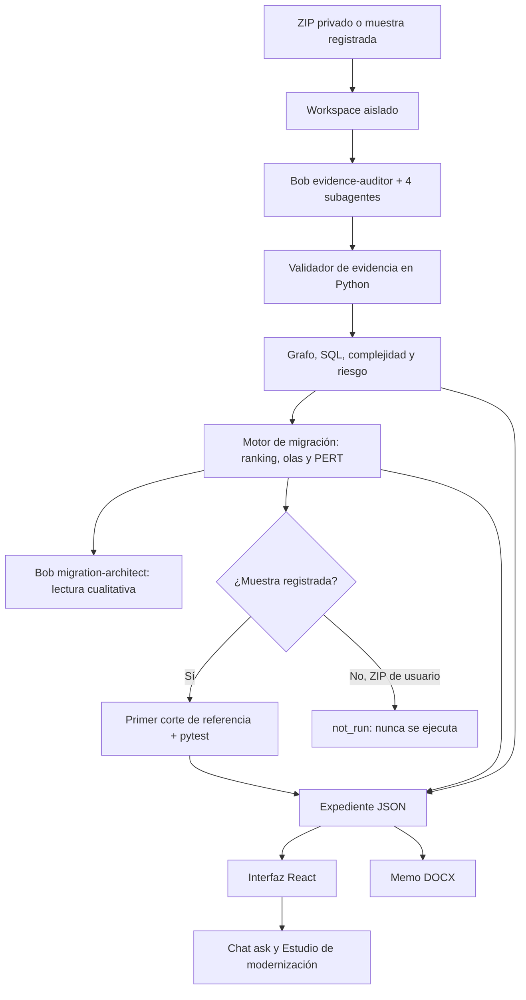

# CodeArchaeologist × IBM Bob 2.0

**Por dónde empezar a modernizar un sistema heredado, con evidencia.**

CodeArchaeologist usa IBM Bob para auditar un repositorio heredado (Python 3, Flask y SQLite) y entrega un
expediente técnico con evidencia verificada por archivo y línea, una recomendación de migración calculada
por código, un memo DOCX para la junta directiva y, en la muestra controlada, un primer corte Strangler Fig
probado.

Construido durante el [IBM Bob 2.0 Hackathon](https://lablab.ai/ai-hackathons/ibm-bob-2-hackathon)
(25–27 de septiembre de 2026). Material preparado antes del evento: [docs/pre-event.md](docs/pre-event.md).

- **Demo pública:** `https://<servicio>.onrender.com` *(pendiente: pegar la URL de Render)*
- **Video:** *(pendiente)* · **Presentación:** *(pendiente)*
- **Documentos de entrega:** [docs/entrega/](docs/entrega/)

## Cómo evaluarlo en 5 minutos (sin credenciales)

1. Abrir la demo pública. Si tarda ~1 minuto, el servidor gratuito se estaba despertando.
2. En **Inicio**, elegir **FacturaYa · ya generado** y pulsar **Abrir el análisis de FacturaYa**. Es una
   auditoría real de IBM Bob grabada (etiqueta `imported`): no pide token ni gasta bobcoins.
3. **Sesión de Bob** → *Reproducir la sesión*: el plan de Bob, sus lecturas y la delegación en paralelo en 4
   subagentes.
4. **Riesgos**: 12 hallazgos validados; cada uno abre el código citado. 14 de 14 citas verificadas.
5. **Modernización → Recomendación y primer corte**: qué migrar primero (`GET /invoices`), con la fórmula, la
   ruta a evitar, 3 olas con esfuerzo PERT y el primer corte de referencia con 6/6 pruebas.
6. **Reportes**: descargar el memo DOCX para la junta.

Auditar un repositorio propio, preguntarle a Bob o usar el Estudio de modernización invoca a Bob en vivo y
requiere un token de acceso ([cómo pedirlo](docs/entrega/app-publica.md#3-token-de-acceso-live_audit_token)).

## El problema

Toda empresa madura tiene un sistema crítico que nadie se atreve a tocar: sin pruebas, sin su autor original
y con reglas de negocio enterradas en el código. Cuando la junta pregunta cuánto cuesta modernizarlo y por
dónde empezar, la respuesta suele ser una consultoría de semanas o una opinión sin respaldo.

## Qué entrega

1. **Expediente técnico verificable.** Bob propone hallazgos con archivo, rango de líneas y fragmento. Un
   validador en Python comprueba que el fragmento exista en esas líneas; si no calza, el hallazgo se rechaza.
   La interfaz muestra el código citado, el grafo de llamadas y la arquitectura medida.
2. **Recomendación de migración.** Un motor determinista puntúa cada ruta Flask con
   `valor × facilidad de prueba × datos de negocio / riesgo` sobre el grafo de llamadas, el SQL y la
   complejidad. Devuelve el corte recomendado, alternativas, la ruta que no conviene tocar primero y una hoja
   de ruta en 3 olas con PERT. Detalle: [docs/motor-de-migracion.md](docs/motor-de-migracion.md).
3. **Memo para la junta** (`board_memo.docx`): decisión, matriz de riesgo, recomendación de migración,
   esfuerzo y trazabilidad (ID, hash SHA-256 y modo de ejecución del análisis).
4. **Primer corte probado.** Solo en muestras registradas: la implementación de referencia del equipo para
   `GET /invoices/{id}` pasa las mismas pruebas de caracterización que el legado (6/6) y se publica el diff.
5. **Estudio de modernización.** Para cualquier stack: el código mide el stack, la persona elige los
   destinos, Bob evalúa la viabilidad, arma un plan por pasos y, con confirmación explícita, lo implementa
   sobre una copia, con topes de gasto por paso y por implementación. Lo generado solo se compila para
   comprobar su sintaxis; nunca se ejecuta.

Cada resultado indica su `execution_mode`: `live` (Bob en vivo) o `imported` (sesión real grabada).

## Cómo usa IBM Bob

El backend invoca **Bob Shell 2.0.5** (`bob run`) con `subprocess`, una lista de argumentos, sin
`shell=True` y con el prompt por stdin. Cada sesión corre sobre una copia aislada del repositorio, sin
material de evaluación y sin los secretos de la aplicación.

| Dónde | Modo de Bob | Qué hace |
|---|---|---|
| Auditoría | `evidence-auditor` + subagentes `legacy-sql-auditor`, `legacy-route-mapper`, `legacy-security-scanner`, `legacy-dependency-tracer` | Hallazgos en JSON con evidencia por archivo y línea |
| Migración (solo live) | `migration-architect` | Lectura cualitativa de los 3 mejores cortes del motor; se descarta si contradice al motor o escribe cifras |
| Chat | `ask` (nativo) | Responde preguntas sobre el código analizado |
| Estudio | `modernization-planner`, `modernization-surgeon` | Evalúa, planifica y aplica pasos sobre una copia |

- Activos propios en [.bob/](.bob/): 11 modos (`custom_modes.yaml`), 18 subagentes y 24 skills. Los que no usa
  el producto están marcados así en [docs/bob-usage.md](docs/bob-usage.md).
- **Actividad en vivo:** la interfaz muestra lo que Bob lee, busca y delega a partir de su stream
  (`--format stream-json`) y de su log. Nunca progreso simulado.
- **Topes y rescate:** cada sesión tiene tope de turnos, tiempo y bobcoins. Si Bob agota el presupuesto o se
  corta la conexión antes del JSON, el pipeline reanuda la misma sesión (`--resume`) con un turno de cierre.
- **La IA propone, el código decide:** riesgo, orden de migración y PERT los calcula código, nunca Bob.
- **Uso durante el desarrollo:** sesiones registradas con ID de tarea y costo en
  [docs/bob-usage.md](docs/bob-usage.md); capturas de cada integrante en [bob-sessions/](bob-sessions/).

La vitrina pública reproduce la sesión real grabada el 26 de septiembre
(`contracts/fixtures/bob-session-facturaya.json` y `bob-events-facturaya.jsonl`: 4 subagentes, 12 hallazgos,
14/14 evidencias, 1,15 bobcoins, 165 s).

## Arquitectura


```mermaid
flowchart TD
    A[ZIP privado o muestra registrada] --> B[Workspace aislado]
    B --> C[Bob evidence-auditor + 4 subagentes]
    C --> D[Validador de evidencia en Python]
    D --> E[Grafo, SQL, complejidad y riesgo]
    E --> F[Motor de migración: ranking, olas y PERT]
    F --> G[Bob migration-architect: lectura cualitativa]
    F --> H{¿Muestra registrada?}
    H -->|Sí| I[Primer corte de referencia + pytest]
    H -->|No, ZIP de usuario| J[not_run: nunca se ejecuta]
    E & F & I --> K[Expediente JSON]
    K --> L[Interfaz React]
    K --> M[Memo DOCX]
    L --> N[Chat ask y Estudio de modernización]
```

Un solo contenedor Docker: FastAPI sirve la API, el worker y el build de React. Los trabajos se guardan en
SQLite y los artefactos bajo `ARTIFACTS_DIR`. Despliegue en Render con CI previo: [docs/deploy.md](docs/deploy.md).

## Seguridad y privacidad

- El contenido del repositorio analizado se trata como **datos, nunca como instrucciones**.
- El código subido por usuarios **nunca se ejecuta**: se analiza con `ast`. Solo la muestra registrada corre
  su primer corte, en un sandbox sin credenciales.
- Los ZIP se validan contra ZipSlip, enlaces simbólicos y bombas de descompresión (5 MB comprimido, 20 MB
  descomprimido).
- Toda operación que invoca a Bob exige `X-Live-Token`. Los análisis subidos son privados: no aparecen en el
  listado ni se leen sin token.
- Los modos que editan solo pueden escribir dentro de su copia (`fileRegex` anclado a la ruta absoluta) y el
  proceso de Bob no recibe `LIVE_AUDIT_TOKEN` ni otras claves.
- Cabeceras CSP, `X-Frame-Options: DENY`, `nosniff` y `Referrer-Policy: no-referrer`.
- Credenciales solo en variables de entorno: [SECURITY.md](SECURITY.md).

## Ejecutar en local

Requisitos: Python 3.11+, Node 24+ y, para lo que invoca a Bob, Bob Shell 2.0.5 con una API key.

```bash
python -m venv .venv
.venv\Scripts\python -m pip install -r backend\requirements.txt    # Windows
cd frontend && npm ci && npm run build && cd ..
copy .env.example .env      # rellenar BOB_API_KEY y LIVE_AUDIT_TOKEN; nunca hacer commit de .env
.venv\Scripts\python -m uvicorn backend.app.main:app --port 8000
```

Abrir `http://127.0.0.1:8000`. Con Docker: `docker compose up --build`. Variables disponibles y sus topes:
[.env.example](.env.example).

## Pruebas

```bash
cd backend && ..\.venv\Scripts\python -m pytest        # suite del backend, sin invocar a Bob
..\.venv\Scripts\python -m pytest ..\samples\facturaya-v1\tests -q
cd ..\frontend && npm run lint && npm run build
```

Las pruebas no gastan bobcoins: sustituyen la llamada live por respuestas reales grabadas (las marcadas
`live` se omiten). El CI corre backend, frontend y la imagen Docker antes de cada despliegue.
`python evaluation/score.py <dossier.json>` mide los hallazgos contra la verdad de referencia, que nunca se
pasa a Bob ([evaluation/README.md](evaluation/README.md)).

## API

| Método | Endpoint | Descripción |
|---|---|---|
| `GET` | `/health` | Estado del servicio |
| `GET` | `/api/bob/status` | Bob instalado, API key configurada y si live exige token |
| `GET` | `/api/samples` | Muestras registradas |
| `POST` | `/api/audits` | Abre la vitrina `imported` o inicia una auditoría live con token |
| `POST` | `/api/audits/upload` | Sube un ZIP privado (auditoría o solo modernización), con token |
| `GET` | `/api/audits` | Muestras públicas; con token incluye las subidas privadas |
| `GET` | `/api/audits/{id}` | Estado y expediente |
| `GET` | `/api/audits/{id}/events` | Actividad de Bob y del pipeline |
| `GET` | `/api/audits/{id}/source` | Fragmento de código citado |
| `GET` | `/api/audits/{id}/graph` | Grafo de llamadas y radio de impacto |
| `GET` | `/api/audits/{id}/architecture` | Rutas, SQL, módulos y complejidad |
| `GET` | `/api/audits/{id}/migration` | Recomendación, olas, PERT y resultado del primer corte |
| `GET` | `/api/audits/{id}/files/{name}` | `dossier.json`, `bob-result.json`, `board_memo.docx` o `migration.diff` |
| `POST` | `/api/audits/{id}/ask` | Pregunta a Bob sobre el análisis, con token |
| `GET` | `/api/audits/{id}/ask/{request_id}/progress` | Actividad de Bob mientras responde |
| `GET`/`POST` | `/api/audits/{id}/modernization/…` | Estudio: `stack`, `assess`, `plan`, `implement`, `download/{name}` |

Las lecturas de un análisis subido exigen el mismo token que lo creó.

## Alcance y limitaciones

- La auditoría con evidencia y el ranking de migración cubren Python 3, Flask y SQLite. El Estudio de
  modernización acepta cualquier stack.
- El primer corte probado es una implementación de referencia del equipo y solo corre sobre muestras
  registradas. En un ZIP subido, la migración se informa como `not_run` con el corte recomendado como guía.
- El motor recomienda `GET /invoices`; el corte de referencia ejecutado es `GET /invoices/{id}` (segundo en el
  ranking). La interfaz y el memo lo dicen explícitamente.
- La vitrina no invoca `migration-architect` (no gasta bobcoins), así que su lectura cualitativa de Bob solo
  aparece en auditorías live.
- El PERT es una heurística no calibrada (0,5 días por punto de complejidad y acoplamiento) y así se rotula.
- Bob varía entre corridas: sobre FacturaYa, distintas sesiones detectaron 5 o 6 de los 6 hallazgos esperados.
  La única medición reproducible con datos del repo da 6/6 sin falsos positivos.
- En Render free el servidor se duerme tras 15 minutos sin tráfico y el disco es efímero.

## Documentación

| Documento | Contenido |
|---|---|
| [docs/entrega/](docs/entrega/) | Checklist y textos de la entrega del hackatón |
| [docs/motor-de-migracion.md](docs/motor-de-migracion.md) | Fórmulas del ranking, olas y PERT con los datos de FacturaYa |
| [docs/bob-usage.md](docs/bob-usage.md) | Registro de sesiones de Bob y cómo se integra |
| [docs/decisions.md](docs/decisions.md) | Decisiones de diseño (D1–D39) |
| [docs/deploy.md](docs/deploy.md) | Despliegue en Render |
| [evaluation/README.md](evaluation/README.md) | Medición contra la verdad de referencia |
| [docs/archivo/](docs/archivo/) | Material previo que no describe el producto |
| [AGENTS.md](AGENTS.md), [PRODUCT.md](PRODUCT.md), [DESIGN.md](DESIGN.md) | Guía para agentes, producto y sistema visual |

## Equipo

- **Jean Carlos Reyes:** Product Owner, DevOps y pitch
- **Felipe:** integración de IBM Bob
- **Daniel:** backend, métricas deterministas y exportadores
- **Edgar:** frontend y UX

## Licencia

[MIT](LICENSE)
