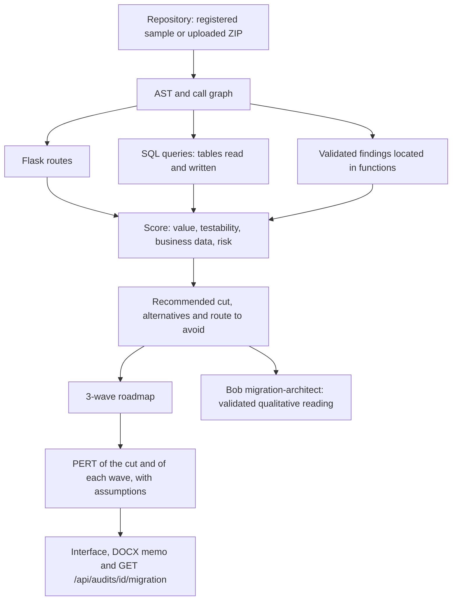

# Deterministic migration engine (Strangler Fig)

CodeArchaeologist does not let a language model invent the migration order, the risk or the timelines. It splits
the responsibilities like this:

1. **IBM Bob** audits the code (`evidence-auditor` mode, with subagents) and cites the file, lines and snippet of
   every finding. Then, in `migration-architect` mode, it writes the qualitative reading of the candidate routes.
2. **The Python engine** (`backend/app/pipeline/migration_ranking.py`) reads the syntax tree and the call graph,
   inventories the SQL and computes each route's score **without running the analyzed code**.



## 1. Score of each route

A route's scope is its function plus every function it calls, directly or transitively, according to the AST call
graph.

| Dimension | Calculation |
|---|---|
| **Value** | `1 + Σ weight of the validated findings inside the scope` (critical 4, high 3, medium 2, low 1) |
| **Risk** | `1 + functions shared with other routes + 2 × written tables + complexity/5 + lines/50 + 2 if there is a circular dependency` |
| **Testability** | `1.0` if it returns JSON; `0.5` if it is a read-only view; `0.25` if it is a POST or writes to the database |
| **Business data** | `1.0` if the scope reads or writes any table; `0.5` if it touches no data (e.g. `logout`, `index`) |
| **Score** | `value × testability × business data / risk` |

The business-data factor applies decision D3 (the first cut must be visible to the business). Without it, a trivial
route of a few lines that happened to hold the evidence line of a cross-cutting finding (CSRF) came first.

## 2. Ranking on FacturaYa v1

The real result of the public showcase: `samples/facturaya-v1` (10 routes) with the recorded Bob session it replays
(`contracts/fixtures/bob-session-facturaya.json`: 12 validated findings, 14/14 evidence).

| # | Route | Function | Value | Testability | Data | Risk | Score | Mitigates |
|---|---|---|---|---|---|---|---|---|
| 1 | `GET /invoices` | `invoices_list` | 5 | 0.5 | 1 | 4.54 | **0.551** | F-1 |
| 2 | `GET /invoices/<int:invoice_id>` | `invoice_json` | 5 | 1 | 1 | 10.06 | 0.497 | F-2 |
| 3 | `POST /logout` | `logout` | 4 | 0.25 | 0.5 | 1.28 | 0.391 | F-5 |
| 4 | `GET /customers/<int:customer_id>` | `customer_detail` | 4 | 0.5 | 1 | 8.24 | 0.243 | F-10 |
| 5 | `GET /` | `index` | 1 | 0.5 | 0.5 | 1.58 | 0.158 | — |
| 6 | `GET, POST /invoices/new` | `invoice_new` | 9 | 0.25 | 1 | 30.5 | 0.074 | F-4, F-8, F-11 |
| 7 | `GET /invoices/<int:invoice_id>/view` | `invoice_html` | 1 | 0.5 | 1 | 7.28 | 0.069 | — |
| 8 | `GET /customers` | `customers_list` | 1 | 0.5 | 1 | 7.42 | 0.067 | — |
| 9 | `GET /reports/monthly` | `report_monthly` | 1 | 0.5 | 1 | 8.94 | 0.056 | — |
| 10 | `GET, POST /login` | `login` | 1 | 0.25 | 1 | 5.38 | 0.046 | — |

- **Recommended cut: `GET /invoices`.** It is read-only, serves business data and mitigates F-1, the critical SQL
  injection in the search.
- **Do not start with `GET, POST /invoices/new`:** it concentrates the most findings (value 9), but it is also the
  riskiest (30.5): it is a POST and writes to `invoices` and `invoice_items`.
- **Reference cut that runs:** the team implemented and tested `GET /invoices/{id}` (JSON, mitigates the critical
  IDOR F-2), which the engine ranks second. The interface and the memo state that difference explicitly:
  *"The engine recommends GET /invoices (score 0.551), while the first reference cut that was run is
  GET /invoices/<int:invoice_id> (score 0.497); its tests passed."*

The figures change if the Bob session changes: another run can report different findings and, with them, another
value per route. The calculation is always the same, and the interface shows it in full.

## 3. Roadmap by waves and PERT

| Wave | Criterion | Routes in FacturaYa | Expected PERT (range) |
|---|---|---|---|
| 1 · First safe cuts | Returns JSON, or a read view with risk ≤ 5, with no writes | `GET /invoices`, `GET /invoices/<id>`, `GET /` | 11.2 d (6.3–18.9) |
| 2 · Intermediate views | Read views with risk between 5 and 15, with no writes | `GET /customers/<id>`, `GET /invoices/<id>/view`, `GET /customers`, `GET /reports/monthly` | 18.67 d (10.5–31.5) |
| 3 · Transactional domain | POST, database writes or risk > 15 | `logout`, `invoices/new`, `login` | 22.93 d (12.9–38.7) |

If there is no low-coupling read route at all, the waves follow the ranking order and their names say so.

**PERT of each scope:**

```
points = 2 × routes + functions + ⌈lines / 25⌉ + ⌈complexity / 5⌉
M = points × 0.5 days      O = 0.6 × M      P = 1.8 × M      E = (O + 4M + P) / 6
```

For the recommended cut (1 route, 3 functions, 27 lines, complexity 5): **E = 4.27 days** (2.4 to 7.2).
Every estimate carries the assumption *"Uncalibrated heuristic estimate (0.5 days per point of complexity and
coupling)"*: it is for planning, not a schedule commitment.

## 4. What Bob does here (and what it does not)

`migration-architect` receives the ranking's top 3 candidates (endpoint, measured justification and the findings
each one mitigates) and writes one option per candidate. A code validator rejects the reply if:

- it describes an endpoint that is not in the ranking, or repeats one;
- it cites findings that candidate does not mitigate;
- it includes figures, percentages or timelines written in words;
- it recommends a cut other than the one the engine picked.

If the reply is rejected or Bob fails, the options stay empty and the reason is recorded: they are never filled with
templates. The session is bounded (6 turns, 1 bobcoin, no subagents). The imported showcase never calls Bob.

## 5. Tested first cut and security

- Only registered samples run the reference cut: the sample is copied to a sandbox, the team's modern
  implementation (`modern/invoices_api.py` and `facade.py`) is applied and pytest runs the characterization tests
  against the legacy code and against the new code (6 of 6 pass on FacturaYa).
- The code of an uploaded ZIP **never runs**: it is analyzed with the `ast` module and its migration result is
  `not_run`, with the recommended cut as a reference.
- File paths are validated against the workspace (`resolve_inside`); uploaded jobs are private (never listed, and in
  locked mode they require `X-Live-Token`).

## 6. API

`GET /api/audits/{id}/migration` returns the full recommendation (`recommendation`, `candidates`,
`recommended`, `alternatives`, `do_not_start_here`, `waves`, `first_cut_pert`) and, if the cut ran, the legacy
code, the modern code, the facade and the result of each test.
