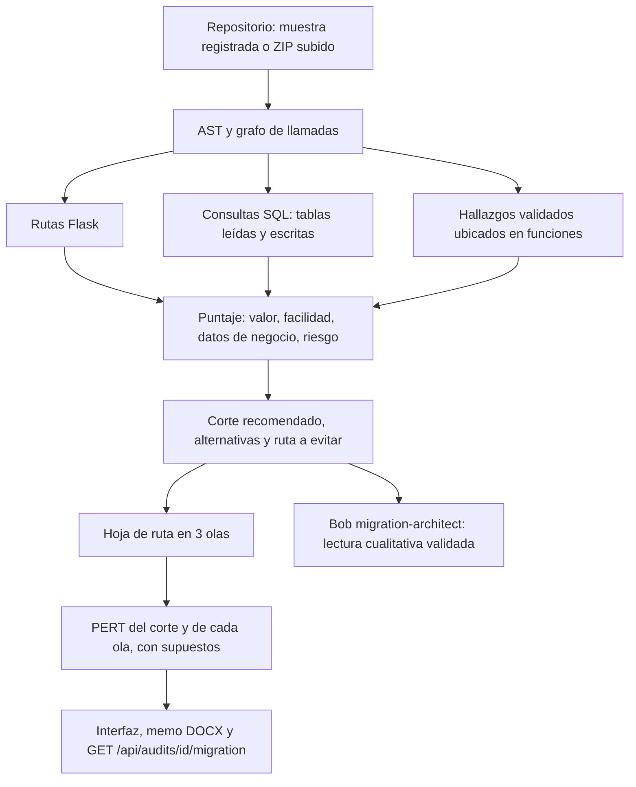

# Motor determinista de migración (Strangler Fig)

CodeArchaeologist no deja que un modelo de lenguaje invente el orden de migración, el riesgo ni los plazos.
Separa las responsabilidades así:

1. **IBM Bob** audita el código (modo `evidence-auditor`, con subagentes) y cita archivo, líneas y fragmento de
   cada hallazgo. Después, en modo `migration-architect`, redacta la lectura cualitativa de las rutas candidatas.
2. **El motor en Python** (`backend/app/pipeline/migration_ranking.py`) lee el árbol sintáctico y el grafo de
   llamadas, inventaria el SQL y calcula el puntaje de cada ruta **sin ejecutar el código analizado**.



## 1. Puntaje de cada ruta

El alcance de una ruta es su función más todas las funciones que llama, directa o transitivamente, según el
grafo de llamadas del AST.

| Dimensión | Cálculo |
|---|---|
| **Valor** | `1 + Σ peso de los hallazgos validados dentro del alcance` (crítico 4, alto 3, medio 2, bajo 1) |
| **Riesgo** | `1 + funciones compartidas con otras rutas + 2 × tablas escritas + complejidad/5 + líneas/50 + 2 si hay dependencia circular` |
| **Facilidad de prueba** | `1.0` si responde JSON; `0.5` si es una vista de solo lectura; `0.25` si es POST o escribe en base de datos |
| **Datos de negocio** | `1.0` si el alcance lee o escribe alguna tabla; `0.5` si no toca datos (p. ej. `logout`, `index`) |
| **Puntaje** | `valor × facilidad × datos de negocio / riesgo` |

El factor de datos de negocio aplica la decisión D3 (el primer corte debe ser visible para negocio). Sin él, una
ruta trivial de pocas líneas que por casualidad contenía la línea de evidencia de un hallazgo transversal
(CSRF) quedaba primera.

## 2. Ranking sobre FacturaYa v1

Resultado real de la vitrina pública: `samples/facturaya-v1` (10 rutas) con la sesión grabada de Bob que ella
reproduce (`contracts/fixtures/bob-session-facturaya.json`: 12 hallazgos validados, 14/14 evidencias).

| # | Ruta | Función | Valor | Facilidad | Datos | Riesgo | Puntaje | Mitiga |
|---|---|---|---|---|---|---|---|---|
| 1 | `GET /invoices` | `invoices_list` | 5 | 0.5 | 1 | 4.54 | **0.551** | F-1 |
| 2 | `GET /invoices/<int:invoice_id>` | `invoice_json` | 5 | 1 | 1 | 10.06 | 0.497 | F-2 |
| 3 | `POST /logout` | `logout` | 4 | 0.25 | 0.5 | 1.28 | 0.391 | F-5 |
| 4 | `GET /customers/<int:customer_id>` | `customer_detail` | 4 | 0.5 | 1 | 8.24 | 0.243 | F-10 |
| 5 | `GET /` | `index` | 1 | 0.5 | 0.5 | 1.58 | 0.158 | — |
| 6 | `GET, POST /invoices/new` | `invoice_new` | 9 | 0.25 | 1 | 30.5 | 0.074 | F-4, F-8, F-11 |
| 7 | `GET /invoices/<int:invoice_id>/view` | `invoice_html` | 1 | 0.5 | 1 | 7.28 | 0.069 | — |
| 8 | `GET /customers` | `customers_list` | 1 | 0.5 | 1 | 7.42 | 0.067 | — |
| 9 | `GET /reports/monthly` | `report_monthly` | 1 | 0.5 | 1 | 8.94 | 0.056 | — |
| 10 | `GET, POST /login` | `login` | 1 | 0.25 | 1 | 5.38 | 0.046 | — |

- **Corte recomendado: `GET /invoices`.** Es de solo lectura, sirve datos de negocio y mitiga F-1, la inyección
  SQL crítica de la búsqueda.
- **No empezar por `GET, POST /invoices/new`:** es la que más hallazgos concentra (valor 9), pero también la de
  mayor riesgo (30.5): es POST y escribe en `invoices` e `invoice_items`.
- **Corte de referencia ejecutado:** el equipo implementó y probó `GET /invoices/{id}` (JSON, mitiga el IDOR
  crítico F-2), que el motor ubica segundo. La interfaz y el memo muestran esa diferencia de forma explícita:
  *"El motor recomienda GET /invoices (puntaje 0.551), mientras que el primer corte de referencia ejecutado es
  GET /invoices/<int:invoice_id> (puntaje 0.497); sus pruebas pasaron."*

Las cifras cambian si cambia la sesión de Bob: otra corrida puede reportar hallazgos distintos y, con ellos,
otro valor por ruta. El cálculo es siempre el mismo y se ve completo en la interfaz.

## 3. Hoja de ruta por olas y PERT

| Ola | Criterio | Rutas en FacturaYa | PERT esperado (rango) |
|---|---|---|---|
| 1 · Primeros cortes seguros | Responde JSON, o vista de lectura con riesgo ≤ 5, sin escrituras | `GET /invoices`, `GET /invoices/<id>`, `GET /` | 11.2 d (6.3–18.9) |
| 2 · Vistas intermedias | Vistas de lectura con riesgo entre 5 y 15, sin escrituras | `GET /customers/<id>`, `GET /invoices/<id>/view`, `GET /customers`, `GET /reports/monthly` | 18.67 d (10.5–31.5) |
| 3 · Dominio transaccional | POST, escrituras en base de datos o riesgo > 15 | `logout`, `invoices/new`, `login` | 22.93 d (12.9–38.7) |

Si no existe ninguna ruta de lectura con bajo acoplamiento, las olas siguen el orden del ranking y sus nombres
lo dicen.

**PERT de cada alcance:**

```
puntos = 2 × rutas + funciones + ⌈líneas / 25⌉ + ⌈complejidad / 5⌉
M = puntos × 0,5 días      O = 0,6 × M      P = 1,8 × M      E = (O + 4M + P) / 6
```

Para el corte recomendado (1 ruta, 3 funciones, 27 líneas, complejidad 5): **E = 4,27 días** (2,4 a 7,2).
Cada estimación lleva el supuesto *"Estimación heurística, no calibrada (0,5 días por punto de complejidad y
acoplamiento)"*: sirve para planificar, no es un compromiso de calendario.

## 4. Qué hace Bob aquí (y qué no)

`migration-architect` recibe los 3 mejores candidatos del ranking (endpoint, justificación medida y hallazgos que
mitiga) y redacta una opción por candidato. Un validador en código rechaza la respuesta si:

- describe un endpoint que no está en el ranking o repite uno;
- cita hallazgos que ese candidato no mitiga;
- incluye cifras, porcentajes o plazos escritos con palabras;
- recomienda un corte distinto del que eligió el motor.

Si la respuesta se rechaza o Bob falla, las opciones quedan vacías y se registra el motivo: nunca se rellenan con
plantillas. La sesión está acotada (6 turnos, 1 bobcoin, sin subagentes). En la vitrina importada no se llama a Bob.

## 5. Primer corte probado y seguridad

- Solo las muestras registradas ejecutan el corte de referencia: se copia la muestra a un sandbox, se aplica la
  implementación moderna del equipo (`modern/invoices_api.py` y `facade.py`) y pytest corre las pruebas de
  caracterización contra el legado y contra el código nuevo (6 de 6 pasan en FacturaYa).
- El código de un ZIP subido **nunca se ejecuta**: se analiza con el módulo `ast` y su resultado de migración es
  `not_run`, con el corte recomendado como referencia.
- Las rutas de archivos se validan contra el workspace (`resolve_inside`); los trabajos subidos exigen `X-Live-Token`.

## 6. API

`GET /api/audits/{id}/migration` devuelve la recomendación completa (`recommendation`, `candidates`,
`recommended`, `alternatives`, `do_not_start_here`, `waves`, `first_cut_pert`) y, si el corte se ejecutó, el
código legado, el moderno, la fachada y el resultado de cada prueba.
